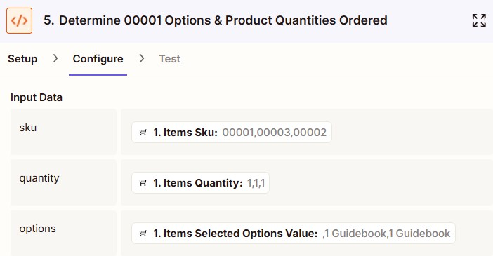

# Ecwid Web Store - Zapier Python Code

For this project, we needed to take in the Ecwid sale data and extract purchase information for a single product in an order so that we could track each product sale separately in Salesforce as its own opportunity record. The order number would be added to the opportunity so that orders with multiple products could still be tracked collectively.

