# Ecwid Web Store Integration - Zapier Python Code

For this project, we needed to take in the Ecwid sale data and extract purchase information for a single product in order to track each product sale separately in Salesforce as its own opportunity record. The order number would be added to the opportunity so that orders with multiple products could still be tracked collectively via reports. 

This documentation shows how I configured this zap and some custom Python code written to complete various tasks.

#### Systems: Ecwid | Zapier | Salesforce

___

Quick links:

[Determine Ecwid Product Quantities & Options](#step-5---determine-product-quantities--options)


___

## Zap setup:


### Steps 1 through 4 

These steps involved taking in the store order and filtering for the specific product number (00002 in this example - a resource guide), as well as some formatting needed for subsequent steps.
<br>
<br>


<kbd></kbd>


<br>

*Note: the step that involves extracting the domain from an email address was something that worked well for our organization to use. Since our main customer base consists of higher education professionals, we had the unique situation that customer email domains would match up with an institution's website domain more often than not. We were able to use this to more accurately match customers with the correct account. 

___

### Step 5 - Determine Product Quantities & Options 

[<b>🡅</b>](#ecwid-web-store-integration---zapier-python-code)
<br>


<br>

Step 5 Code (Python)
```python
import json

# This code tests for different quantities and scu numbers to find the one we're looking for 
#   (In this partular Zap - '00002' or the CSA Guide)
#       Sample quantity q_list = ['1', '3', '2', '4']
#       Sample sku_list = ['00001', '00003', '00003', '00003']

# Steps: split input_data into three separate lists for quanity, sku, and options
#   Here's an example of what input_data would look like:
#       input_data = {'sku': '00003,00003', 'quantity': '1,1'}

q_list = list(input_data.get('quantity').split(","))
sku_list = list(input_data.get('sku').split(","))
opt_list = list(input_data.get('options').split(","))

# Dynamically set up a key to equal entry, and use a for loop to add in which 
# quantity based on the instance of finding a scu 00002
#   It will keep track of which one we're on (how many we've found)
#   Each will be stored in the json formatted string as Quantity1, Quantity2

q_index = 'Quantity'

rstring = ''          # Initialize the return string to parse into json loads

entries = {}          # If you return entries, it works, but we want to return size too

size = 0              # We want to know how many 00002 items were purchased
                      #     within each category - 5 Pack, 1 Guidebook
                      #     so we can use that to add multiple products by pricebook entry ids

i = 1                 # Keep track of which 00002 entry we're on. 

# Loop through each list and for each 00002 scu we find, add an entry# to the string
#   and increase the size and entry# (i) counters

for x in range(len(q_list)):
    if sku_list[x] == '00002':
        q_index = q_index + str(i)
        entries[q_index] = q_list[x]
        if size >= 1:
            rstring = rstring + ', \"' + q_index + '\"' + ': ' + '\"' + q_list[x] + '\"'
        else:
            rstring = rstring + '\"' + q_index + '\"' + ': ' + '\"' + q_list[x] + '\"'
        q_index = 'Quantity'
        size += 1
        i += 1

# Create a json-formatted string for size to concatenate to the main return string
#   use double quotes - was not working with single quotes

size_str = '\"size\"' + ': ' + '\"' + str(size) + '\" '

# Create our return string which must be in a json serializable format.
#   This example string is correct: '{"entry1": "1", "entry2": "1"}'

y = '{' + rstring + ', ' + size_str + '}'

# Use json.loads to format the string to be json seriazable and recognized 
#   by the return function
z = json.loads(y)

# print(type(z))
# print(type(entries))

return z

#return entries    //works, but we wanted to return size too, so we craft a customized string y above

#version: v1. "V2" is in use by Clery C. Jun 29, 2023

```
<br>

Sample Input:

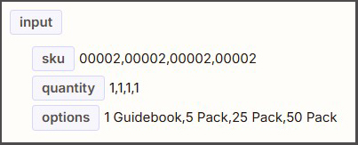

Sample Output:


___


### Steps 6 through 8 

Here we check if the order is paid and determine the payment method and pricebook entry IDs.

<br>


___

### Step 6 - Determine Payment Status

<br>

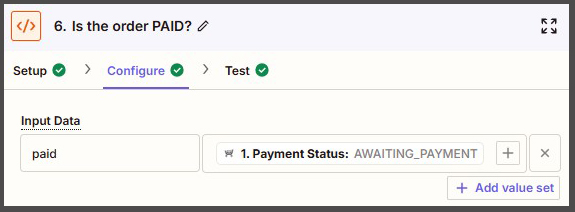

<br>

Step 6 code:

```python

print(input_data)

if 'PAID' in input_data.values():
    status = 'True'
else:
    status = 'False'

return{
    'status': status if status else 'ERROR'
}

```
<br>

Sample Input:

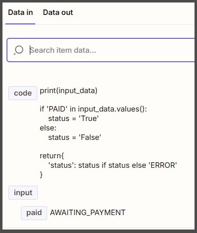

Sample Output:

This code correctly returns "False" since the payment status is "AWAITING_PAYMENT."

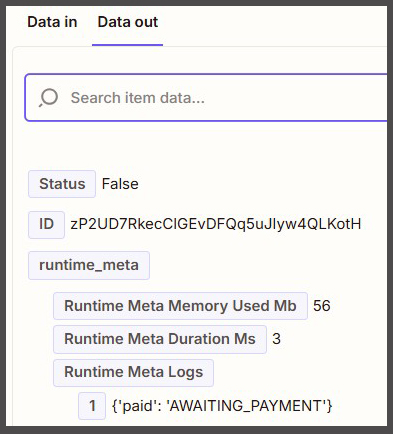
___

### Step 7 - Determine Payment Method
<br>


<br>

Step 7 code:

```python
if 'PayPal' in input_data.values():
    paymentType = 'Credit Card'
elif 'Purchase Order' in input_data.values():
    paymentType = 'Purchase Order'
elif 'Check' in input_data.values():
    paymentType = 'Check'
else:
    paymentType = 'Paypal'
    
return{
    'paymentType': paymentType if paymentType else 'ERROR'
}
```

<br>

Sample Input:

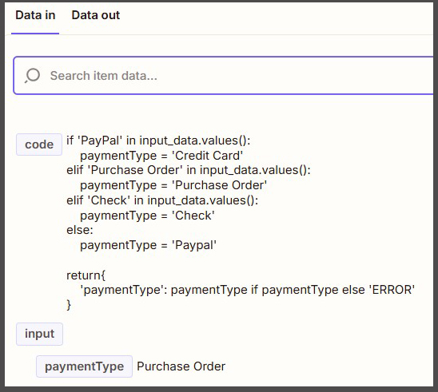


Sample Output:


<br>

___

### Step 8: Determine Pricebook Entry IDs (in Salesforce)
<br>


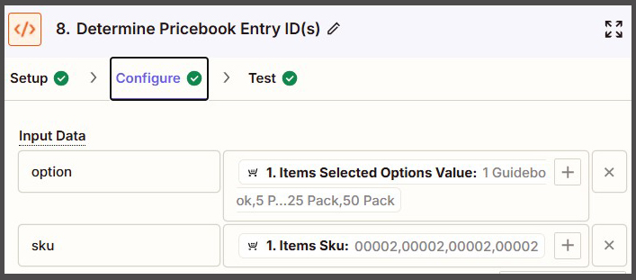

<br>

Step 8 code:


```python
availableOptions = {"1 Guidebook": "01uF000000KgJw2IAF", "5 Pack - $15": "01uF000000La0yhIAB", "25 Pack - $15": "01uF000000La0ymIAB", "50 Pack - $15": "01uF000000La0yrIAB"}
selectedOptions = list(input_data.get('option').split(","))
sku_list = list(input_data.get('sku').split(","))

if('00001' in sku_list):
	index = sku_list.index('00001')
	sku_list.pop(index)
    
if('00009' in sku_list):
	index = sku_list.index('00009')
	sku_list.pop(index)

o_index = "Option"
pEntrySelect = {}
i = 1

for x in range(len(selectedOptions)):
    if sku_list[x] == '00002':
        o_index = o_index + str(i)
        pEntrySelect[o_index] = availableOptions.get(selectedOptions[x])
        o_index = "Option"
        i += 1

return pEntrySelect

```

<br>

Sample Input:
<br>

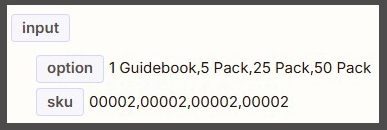

<br>

Sample Output:
<br>

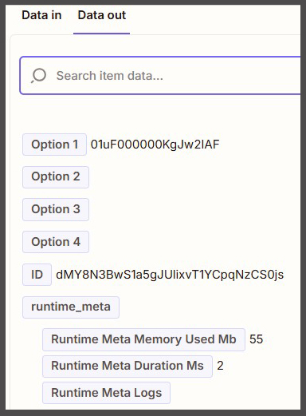

<br>

___

### Step 9: Determine Selected Option Totals

<br>

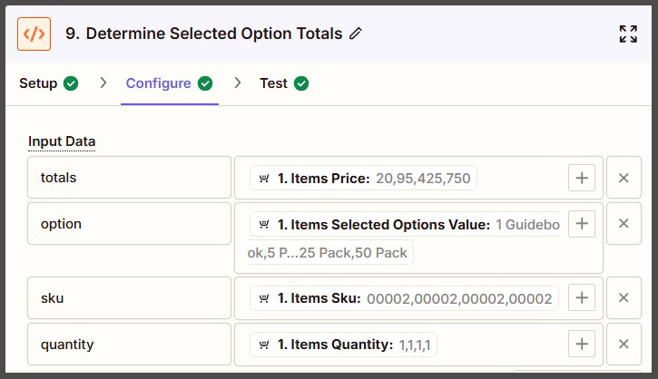

<br>

Step 9 code:

```python

selectedPrices = list(input_data.get('totals').split(","))
selectedOptions = list(input_data.get('option').split(","))
sku_list = list(input_data.get('sku').split(","))
q_list = list(input_data.get('quantity').split(","))

if('00001' in sku_list):
	index = sku_list.index('00001')
	selectedOptions.insert(index, 'None')
    
if('00009' in sku_list):
	index = sku_list.index('00009')
	selectedOptions.insert(index, 'None')

o_index = ''
pEntrySelect = {}
i = 1
optionText = ''
paid = 0

for x in range(len(sku_list)):
    if sku_list[x] == '00002':
        o_index = 'Option' + str(i)
        pEntrySelect[o_index] = float(selectedPrices[x]) * float(q_list[x])
        if i > 1:
            optionText = optionText + "," + selectedOptions[x]
        else:
            optionText = optionText + selectedOptions[x]
        i += 1
        paid += float(selectedPrices[x]) * float(q_list[x])

pEntrySelect['Option Text'] = optionText
pEntrySelect['Total Paid'] = paid
#print(selectedOptions)
return pEntrySelect

```

<br>

Sample Input:

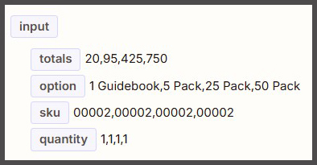

<br>

Sample Output:

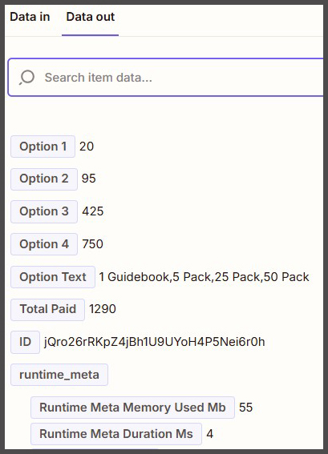